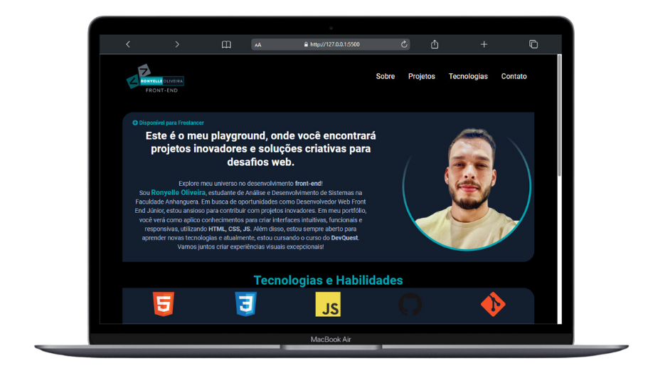
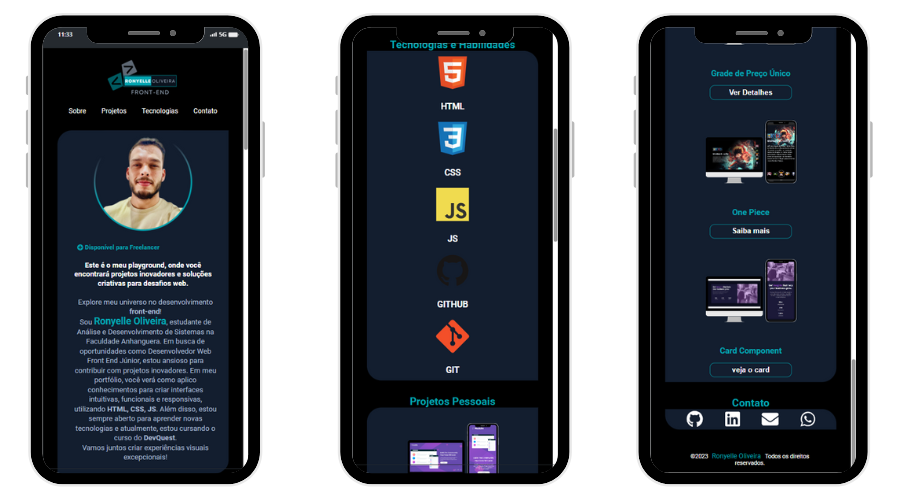

#  Portfólio Pessoal💻

## Visão Geral 👀
O portfólio destaca algumas das habilidades e projetos que tenho desenvolvido ao longo do curso. As animações em hover foram incorporadas para dar um toque interativo e atrativo à apresentação. 🚀

##  Descrição do Projeto 🌐
Os projetos em destaque foram selecionados a partir do que aprendi no curso DevQuest. Eles representam marcos importantes em minha jornada de aprendizado. Cada projeto reflete o esforço e dedicação que investi durante o processo de criação.

## Objetivo 🎯
Meu principal objetivo ao criar este portfólio foi consolidar e aplicar de forma prática os conhecimentos adquiridos até o momento no meu curso de desenvolvimento web. Ao focar exclusivamente em HTML e CSS, busquei não apenas demonstrar minhas habilidades nesses fundamentos, mas também desenvolver um portfólio que refletisse meu estilo e evolução como desenvolvedor.:

## Aprendizados e Reflexões 🧠 
🌱 Crescimento: Desenvolver este portfólio foi uma experiência enriquecedora. A escolha de limitar o uso a HTML e CSS permitiu consolidar os conhecimentos adquiridos até agora. Cada desafio foi uma oportunidade de aprender e melhorar.

💡 Resolução de Problemas: Superar dificuldades na criação da imagem de fundo demonstrou habilidades de resolução de problemas. O processo de tentativa e erro levou a um resultado bem-sucedido.

🤝 Comunidade: Participar de exercícios do Frontend Mentor como parte do curso DevQuest permitiu colaboração dentro da comunidade, aprendizado com colegas e compartilhamento de experiências.

## Futuras Melhorias 💻
Agora, com uma base sólida em HTML e CSS, estou empolgado para avançar no curso e explorar o universo do JavaScript. Os próximos passos incluirão a integração de funcionalidades dinâmicas e interativas nos projetos do portfólio, proporcionando uma experiência mais completa para os visitantes.

Agradeço por acompanhar meu progresso e estou ansioso para compartilhar futuras atualizações à medida que expandir minhas habilidades de desenvolvimento web.

## Gratidão aos Gêmeos e ao DevQuest 🙌
Agradecimentos especiais ao curso DevQuest por proporcionarem um ambiente de aprendizado enriquecedor. O conhecimento adquirido neste exercício, sem dúvida, contribuirá para projetos e empreendimentos futuros.

Sinta-se à vontade para explorar [meu Portfólio](https://ronyelleoliveira.github.io/portifolio-ronyelle-oliveira/) e vivenciar a fusão de criatividade e expertise em codificação! ✨

## Preview Gif 🎥
Dê um play e veja a mágica acontecer no meu Portfólio!🌟

## Preview Desktop 🖥️ 📸
Visualize o Portfólio em todo o seu desktop!

## Preview Mobile 📱 📸
Desfrute da experiência responsiva do Portfólio em dispositivos móveis.

 [Veja meu Portfólio](https://ronyelleoliveira.github.io/portifolio-ronyelle-oliveira/)

## Personalização 🎨
Sinta-se à vontade para Você modificar o projeto do Portfólio, adicionar mais funcionalidades ou integrá-lo a outras tecnologias.

## Tecnologias Utilizadas  💻

## Contribuição 🤝
Contribuições são bem-vindas! Sinta-se à vontade para propor melhorias, correções de bugs ou novos recursos. 🚀

### Agradeço por conferir meu projeto! Espero que este projeto de landing page tenha sido tão emocionante para você quanto foi para mim. Se tiver dúvidas ou sugestões, sinta-se à vontade para entrar em contato.

#### Divirta-se codificando! 😊 

## Contato 📲

### me segue nas redes abaixo!
 

   
  
  
  

